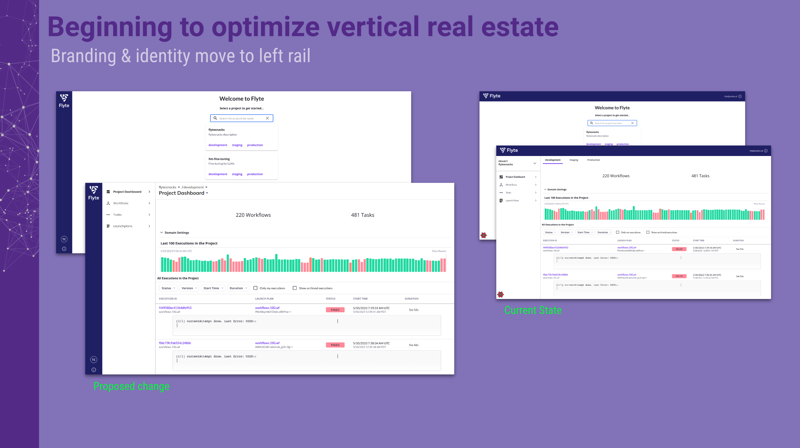

# [RFC Template] Title

**Authors:**

- @tsheiner

## 1 Executive Summary

The proposal is to do a modest branding, orientation & navigation enhancement to the Flyte Console:
1. move the application header to the left side of the viewport
1. introduce consistent bread crumb element on all pages
1. introduce consistent page header on all pages
1. enable the bread crumb & page header elements to also function as navigation controls

## 2 Motivation

The motivation is to respond with usability improvements to the Flyte console in response feedback received from a program of user research that has been initiated by Union.ai. In particular, this proposal introduces initial remediation for 2 specific issues that have been raised:
1.  that the console be more efficient with vertical real estate
1. that it be easier to orient and navigate between node objects and their executions.

## 3 Proposed Implementation

This proposal includes 2 distinct and independent sets of changes. They are bound together here because taken together they create a foundation for further positive change in line with the usability feedback that has been gathered.

The first change is to move the application header that contains the branding and user identity elements from the top of the application window to the left rail. Doing this brings the appearance of the Flyte console more inline with the _de facto_ standard for developer console applications and also frees up ~75px of vertical real estate. The following illustrates this change.

The second change is to introduce breadcrumb and page title elements consistently on all pages. This change is expected to have a positive usability and a11y impact.

In addition to providing a consistent orientation mechanism, the bread crumb and page header elements will also double function as navigational affordances. This is expected to reduce the cognitive load and the clicks required to traverse the application information structure and switch focus between different instanced objects.

## 4 Metrics & Dashboards

*What are the main metrics we should be measuring? For example, when interacting with an external system, it might be the external system latency. When adding a new table, how fast would it fill up?*

## 5 Drawbacks

*Are there any reasons why we should not do this? Here we aim to evaluate risk and check ourselves.*

## 6 Alternatives

*What are other ways of achieving the same outcome?*

## 7 Potential Impact and Dependencies

*Here, we aim to be mindful of our environment and generate empathy towards others who may be impacted by our decisions.*

- *What other systems or teams are affected by this proposal?*
- *How could this be exploited by malicious attackers?*

## 8 Unresolved questions

*What parts of the proposal are still being defined or not covered by this proposal?*

## 9 Conclusion

*Here, we briefly outline why this is the right decision to make at this time and move forward!*

## 10 RFC Process Guide, remove this section when done

*By writing an RFC, you're giving insight to your team on the direction you're taking. There may not be a right or better decision in many cases, but we will likely learn from it. By authoring, you're making a decision on where you want us to go and are looking for feedback on this direction from your team members, but ultimately the decision is yours.*

This document is a:

- thinking exercise, prototype with words.
- historical record, its value may decrease over time.
- way to broadcast information.
- mechanism to build trust.
- tool to empower.
- communication channel.

This document is not:

- a request for permission.
- the most up to date representation of any process or system

**Checklist:**

- [ ]  Copy template
- [ ]  Draft RFC (think of it as a wireframe)
- [ ]  Share as WIP with folks you trust to gut-check
- [ ]  Send pull request when comfortable
- [ ]  Label accordingly
- [ ]  Assign reviewers
- [ ]  Merge PR

**Recommendations**

- Tag RFC title with [WIP] if you're still ironing out details.
- Tag RFC title with [Newbie] if you're trying out something experimental or you're not entirely convinced of what you're proposing.
- Tag RFC title with [RR] if you'd like to schedule a review request to discuss the RFC.
- If there are areas that you're not convinced on, tag people who you consider may know about this and ask for their input.
- If you have doubts, ask on [#feature-discussions](https://slack.com/app_redirect?channel=CPQ3ZFQ84&team=TN89P6GGK) for help moving something forward.
